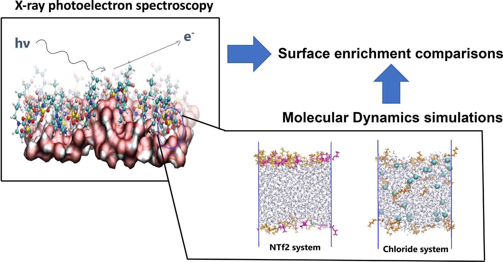

# Surface-IL-water

Check our work out published on the  https://doi.org/10.1002/cphc.202300551: "The Surface of Ionic Liquids in Water: From an Ionic Tug of War to a Quasi-Ordered Two-Dimensional Layer".

## How to Cite this Work

M.-M. Walz, M. R. M. Signorelli, C. Caleman, L. T. Costa, O. Björneholm, ChemPhysChem 2024, 25, e202300551. https://doi.org/10.1002/cphc.202300551.
To cite this work, please use this as reference:

```
@article{https://doi.org/10.1002/cphc.202300551,
author = {Walz, Marie-Madeleine and Signorelli, Matheus Ruas Miranda and Caleman, Carl and Costa, Luciano T. and Björneholm, Olle},
title = {The Surface of Ionic Liquids in Water: From an Ionic Tug of War to a Quasi-Ordered Two-Dimensional Layer},
journal = {ChemPhysChem},
volume = {25},
number = {1},
pages = {e202300551},
keywords = {ionic liquids, molecular dynamics, water-IL interface, water surface, XPS},
doi = {https://doi.org/10.1002/cphc.202300551},
url = {https://chemistry-europe.onlinelibrary.wiley.com/doi/abs/10.1002/cphc.202300551},
eprint = {https://chemistry-europe.onlinelibrary.wiley.com/doi/pdf/10.1002/cphc.202300551},
year = {2024},
}
```

## Abstract

The sustainable development encompasses the search for new materials for energy storage,
gas capture, separation, and solvents in industrial processes that can substitute conventional
ones in an efficient and clean manner. Ionic liquids (ILs) emerged and have been advanced as
alternative materials for such applications, but an obstacle is their hygroscopicity and the 
effects on their physical properties in the presence of humidity. Several industrial processes
depend on the aqueous interfacial properties, and the main focus of this work is the water/IL interface.
The behavior of the aqueous ionic liquids at the water-vacuum interface is representative for
their water interfacial properties. Using X-ray photoelectron spectroscopy in combination with 
molecular dynamics simulations we investigate four aqueous IL systems, and provide molecular level
insight on the interfacial behaviour of the ionic liquids, such as ion-pair formation, orientation
and surface concentration. We find that ionic liquids containing a chloride anion have a lowered 
surface enrichment due to the low surface propensity of chloride. In contrast, the ionic liquids 
containing a bistriflimide anion are extremely surface-enriched due to cooperative surface propensity 
between the cations and anions, forming a two-dimensional ionic liquid on the water surface at low concentrations.



